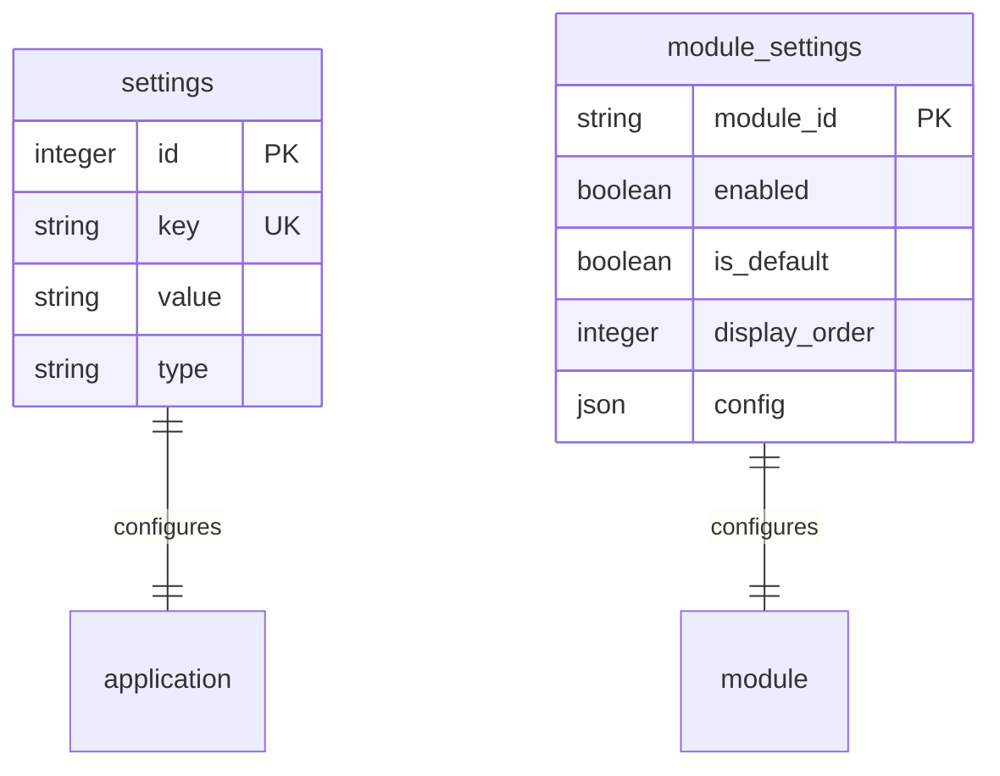

# Data Model Specification

**Feature**: Modular Architecture with Tabbed Interface and Settings
**Date**: 2025-09-16

## Entity Definitions

### 1. Settings
Stores application-wide configuration and preferences.

**Table**: `settings`
| Field | Type | Constraints | Description |
|-------|------|-------------|-------------|
| id | INTEGER | PRIMARY KEY, AUTOINCREMENT | Unique identifier |
| key | TEXT | UNIQUE, NOT NULL | Setting name/key |
| value | TEXT | | Setting value (JSON for complex types) |
| type | TEXT | DEFAULT 'string' | Value type (string, boolean, number, json) |
| description | TEXT | | Human-readable description |
| created_at | DATETIME | DEFAULT CURRENT_TIMESTAMP | Creation timestamp |
| updated_at | DATETIME | DEFAULT CURRENT_TIMESTAMP | Last update timestamp |

**Validation Rules**:
- `key` must be alphanumeric with underscores only
- `type` must be one of: string, boolean, number, json
- `value` must be valid according to `type`

### 2. Module Settings
Controls which modules are enabled and their configuration.

**Table**: `module_settings`
| Field | Type | Constraints | Description |
|-------|------|-------------|-------------|
| id | INTEGER | PRIMARY KEY, AUTOINCREMENT | Unique identifier |
| module_id | TEXT | UNIQUE, NOT NULL | Module identifier |
| name | TEXT | NOT NULL | Display name |
| description | TEXT | | Module description |
| enabled | BOOLEAN | DEFAULT 0 | Whether module is enabled |
| is_default | BOOLEAN | DEFAULT 0 | Cannot be disabled |
| display_order | INTEGER | | Tab display order |
| config | JSON | | Module-specific configuration |
| icon | TEXT | | Icon class or path |
| route | TEXT | | Base route path |
| created_at | DATETIME | DEFAULT CURRENT_TIMESTAMP | Creation timestamp |
| updated_at | DATETIME | DEFAULT CURRENT_TIMESTAMP | Last update timestamp |

**Validation Rules**:
- `module_id` must match installed module IDs
- At least one module must have `enabled = 1`
- Only one module can have `is_default = 1`
- `display_order` must be unique when not null
- `config` must be valid JSON

### 3. Module Registry (Runtime)
In-memory registry of available modules (not persisted).

**Structure**:
```javascript
{
  moduleId: {
    id: string,
    name: string,
    description: string,
    version: string,
    router: Express.Router,
    initialize: Function,
    getTabContent: Function,
    getConfig: Function,
    validateConfig: Function
  }
}
```

## Relationships



## State Transitions

### Module Lifecycle
```
DISCOVERED -> REGISTERED -> ENABLED -> ACTIVE
                |              |          |
                v              v          v
            DISABLED <---- DISABLED <- INACTIVE
```

**States**:
- **DISCOVERED**: Module found in modules/ directory
- **REGISTERED**: Module loaded and validated
- **ENABLED**: User has enabled in settings
- **ACTIVE**: Currently displayed in UI
- **INACTIVE**: Enabled but not currently viewed
- **DISABLED**: User has disabled in settings

## Default Data

### Initial Settings
```sql
INSERT INTO settings (key, value, type, description) VALUES
('app_title', 'AWS Security Dashboard', 'string', 'Application title'),
('theme', 'light', 'string', 'UI theme (light/dark)'),
('auto_refresh', 'false', 'boolean', 'Auto-refresh dashboard'),
('refresh_interval', '300', 'number', 'Refresh interval in seconds');
```

### Initial Module Settings
```sql
INSERT INTO module_settings (module_id, name, enabled, is_default, display_order) VALUES
('aws-inspector', 'AWS Inspector', 1, 1, 1),
('sbom', 'SBOM Reports', 0, 0, 2);
```

## Data Access Patterns

### Common Queries

**Get Enabled Modules**:
```sql
SELECT * FROM module_settings
WHERE enabled = 1
ORDER BY display_order;
```

**Get All Settings**:
```sql
SELECT key, value, type FROM settings;
```

**Update Module Status**:
```sql
UPDATE module_settings
SET enabled = ?, updated_at = CURRENT_TIMESTAMP
WHERE module_id = ?;
```

**Check Minimum Enabled**:
```sql
SELECT COUNT(*) as enabled_count
FROM module_settings
WHERE enabled = 1;
```

## Migration Strategy

### Migration Script
```sql
-- Create settings table
CREATE TABLE IF NOT EXISTS settings (
    id INTEGER PRIMARY KEY AUTOINCREMENT,
    key TEXT UNIQUE NOT NULL,
    value TEXT,
    type TEXT DEFAULT 'string',
    description TEXT,
    created_at DATETIME DEFAULT CURRENT_TIMESTAMP,
    updated_at DATETIME DEFAULT CURRENT_TIMESTAMP
);

-- Create module_settings table
CREATE TABLE IF NOT EXISTS module_settings (
    id INTEGER PRIMARY KEY AUTOINCREMENT,
    module_id TEXT UNIQUE NOT NULL,
    name TEXT NOT NULL,
    description TEXT,
    enabled BOOLEAN DEFAULT 0,
    is_default BOOLEAN DEFAULT 0,
    display_order INTEGER,
    config JSON,
    icon TEXT,
    route TEXT,
    created_at DATETIME DEFAULT CURRENT_TIMESTAMP,
    updated_at DATETIME DEFAULT CURRENT_TIMESTAMP
);

-- Create update trigger for settings
CREATE TRIGGER IF NOT EXISTS update_settings_timestamp
AFTER UPDATE ON settings
BEGIN
    UPDATE settings SET updated_at = CURRENT_TIMESTAMP WHERE id = NEW.id;
END;

-- Create update trigger for module_settings
CREATE TRIGGER IF NOT EXISTS update_module_settings_timestamp
AFTER UPDATE ON module_settings
BEGIN
    UPDATE module_settings SET updated_at = CURRENT_TIMESTAMP WHERE id = NEW.id;
END;

-- Insert default data
INSERT OR IGNORE INTO settings (key, value, type, description) VALUES
('app_title', 'AWS Security Dashboard', 'string', 'Application title'),
('theme', 'light', 'string', 'UI theme'),
('auto_refresh', 'false', 'boolean', 'Auto-refresh dashboard'),
('refresh_interval', '300', 'number', 'Refresh interval in seconds');

INSERT OR IGNORE INTO module_settings (module_id, name, enabled, is_default, display_order, route) VALUES
('aws-inspector', 'AWS Inspector', 1, 1, 1, '/'),
('sbom', 'SBOM Reports', 0, 0, 2, '/sbom');
```

## Data Integrity Rules

1. **Minimum Active Module**: Backend must enforce at least one enabled module
2. **Default Module Protection**: Default module cannot be disabled
3. **Unique Display Order**: No two enabled modules can have same display_order
4. **Valid JSON**: All JSON fields must contain valid JSON or NULL
5. **Type Consistency**: Setting values must match their declared type

## Performance Considerations

- Index on `module_settings.enabled` for quick filtering
- Index on `module_settings.display_order` for sorting
- Index on `settings.key` for fast lookups (already UNIQUE)
- Keep `config` JSON small (<1KB per module)
- Cache settings in memory with TTL of 60 seconds

## Security Considerations

- Sanitize all setting values before storage
- Validate JSON schema for module configs
- No sensitive data in settings (use environment variables)
- Audit log for all settings changes
- Rate limit settings updates (max 10/minute)